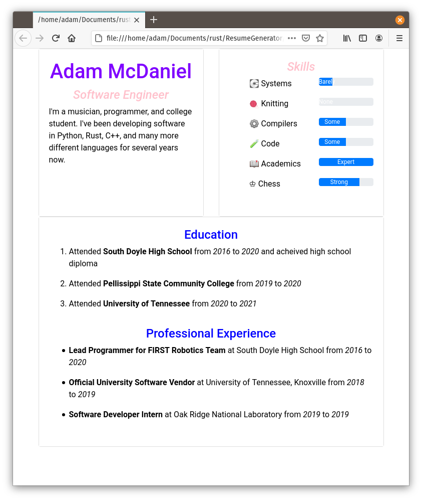
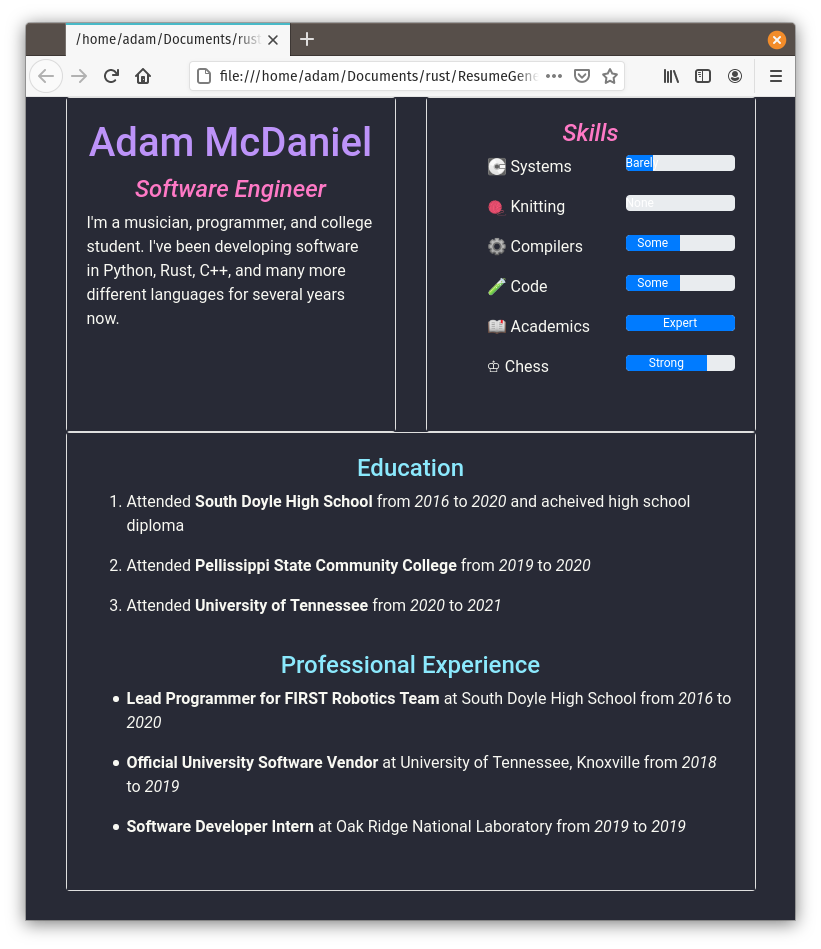
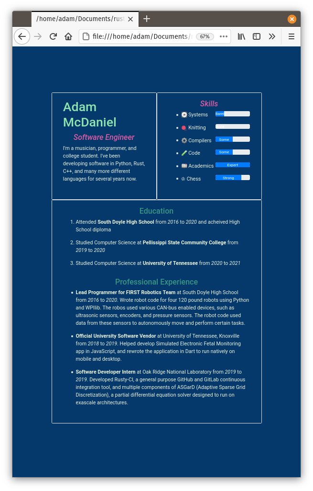

# Final Report
### Team Name
- ResumeGenerator
### Authors
- Adam McDaniel
- Colby Smith

## ***I***. Introduction

Our project is a resume or CV generator that runs on Windows, MacOS, and Debian based Linux distributions. The resume generator prompts the user for info including: information about their previous employment, their education, a description of themselves, their contact information, their skills, and style information about the generated resume.

The generated resume is in HTML format for maximum portability; HTML allows the users to easily feature their resume on a website, show their resume on any device, and print to a PDF using any browser. Additionally, HTML allows the resume generator to plug and play with a variety of stylesheets available to the user.

Our approach was to build the HTML generation before anything else, and then build the GUI around the HTML generating internal structure. This turned out to be a very good strategy, and resulted in the success of the project.

There we a few minor changes to the development plans: because the GUI library we used did not support file operations in the web, we couldn't download the generated resume to the user's computer.

### Example Output

Here are three examples, one using the default light theme, another using the [Dracula theme](https://github.com/dracula/dracula-theme), and the last using our "Forest" theme.

  
  
  

Overall, our results were pretty much what we had in mind. The only goal we didn't complete was our stretch goal (web support).

## ***II***. Customer Value

The main demographic for a resume generator program is going to be unemployeed people seeking employment. Most people in this class will be in this demographic at some point in the next two years. This demographic values
- A clean looking product
- An intuitive GUI
- Low time commitment
- Free tools

There were no changes from the original project proposal.

## ***III***. Technology

This project is implemented in two halves, the library, and the application. The library contains all of the logic of converting user information into the output HTML, which the application portion of the project hooks into with its GUI.

We decided this approach from the very beginning, and it was very successful. Because we planned our architecture thoroughly beforehand, we never needed to change course.

As for tests, our user interface is air-tight. All information is checked for validity before the application allows the user to continue. For example, all numbers are confirmed to be valid unsigned integers, and all non-optional text fields must contain text to continue. So far, we haven't been able to make the program crash *once*.

## ***IV***. Team

We didn't assign roles in our group: we only have two members. Our team members contributed equally. We split up the entire project into components, and each finished them on their own.

## ***V***. Project Management

We completed all of our goals except for one stretch goal (putting the app on the web). The reason we did not add support for the web was because of the lack of support for file operations in the frontend our GUI library. Because of this flaw, we could not download the user's resume to their computer. So, we couldn't possibly complete this goal with our existing codebase.

## ***VI***. Reflection

Everything seemed to go well for this project: we never had a single problem throughout the whole semester, really. We set our sights on a realistic goal, and we were able to finish it without too much trouble. If anything went especially, though, it was probably the GUI implementation. We went from a terminal application, to a working GUI in *just two days*.

Planning was very simple. We used the following schedule to guide our development process.

| Date              | Activity                                        | Goals                                                                    |
|-------------------|-------------------------------------------------|--------------------------------------------------------------------------|
| Thursday, Feb. 18 | Begin work on project.                          | Have a single basic template resume to feed user input into              |
| Friday, Feb. 26   | Second sprint                                   | Add a second template and allow the user to pick between the two         |
| Thursday, Mar. 4  | Submit iteration 1 status report                |                                                                          |
| Friday, Mar. 14   | Third sprint                                    | Upgrade from a commandline based project to having a basic GUI           |
| Thursday, Mar. 18 | Submit iteration 2 status report                |                                                                          |
| Friday, Mar. 26   | Fourth sprint                                   | Improve upon the GUI and make the whole project cleaner and more robust  |
| Thursday, Apr. 1  | Submit iteration 3 status report                |                                                                          |
| Friday, Apr. 9    | Final sprint                                    | Fix bugs, clean up project. add any more ideas we think of along the way |
| Thursday, Apr. 15 | Submit project report and present final product |                                                                          |

Team management was also incredibly simple: there are only two members in our group. We simply split up the project into simple components at the beginning of the semester, and each finished them according to schedule. Whenever we were behind schedule, we would agree to meet and work together until our goals were done.

We consider our final project a massive success. Everything went as planned, we made a great looking app, and we completed it almost a month ahead of schedule. We're very satisfied with the result.

## References

Formal resume definition and expectations outlined [here](https://en.wikipedia.org/wiki/R%C3%A9sum%C3%A9 "Resume Wikipedia")  
Rust [homepage](https://www.rust-lang.org/ "Rust"), [wikipedia](https://en.wikipedia.org/wiki/Rust_(programming_language))  
[Iced GUI for rust](https://news.ycombinator.com/item?id=22766639 "ICED")  

