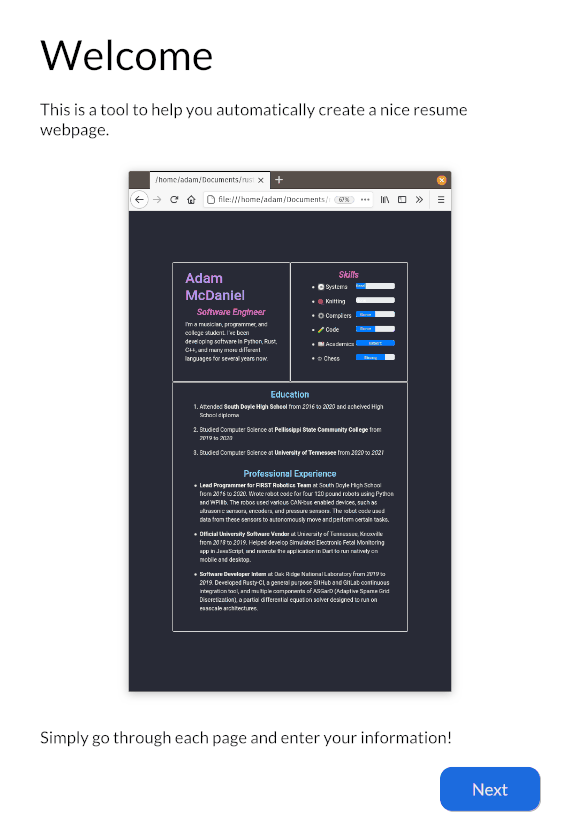
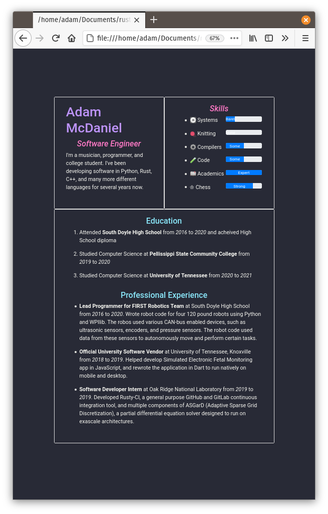

# Team Resume Generator

A cross platform and free resume generating tool.

## Example Output

This resume generator uses themes to generate output HTML code. Here are two examples, one using the default light theme, and another using the [Dracula theme](https://github.com/dracula/dracula-theme).

  
  
  

## Executing

If you're on Linux, simply execute the `run.sh` file in the main directory. If you're on Windows, you should simply be able to compile with `cargo run`!
