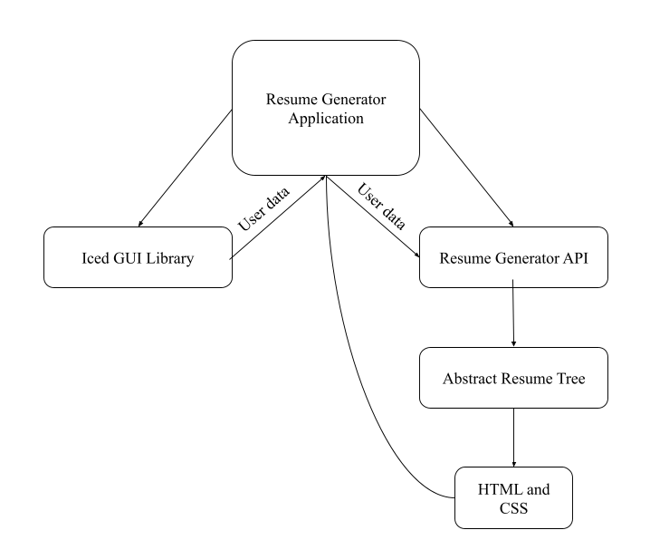

# Resume Generator Proposal

### Authors
- Adam McDaniel
- Colby Smith

## **_I_**. Introduction

Our project is a resume or CV generator that aims to runs on: the web, the desktop (including Windows, MacOS, and Debian based Linux distributions), and potentially mobile. The resume generator will prompt the user with several radio buttons, checklists, and text fields for info including: information about their previous employment, their education, a description of themselves, their contact information, their skills, and finally layout and style information about the generated resume.

The generated resume will be in HTML format for maximum portability; HTML will allow the users to easily feature their resume on a website, show their resume on any device, and print to a PDF using any browser. Additionally, HTML will allow the resume generator to plug and play with a variety of stylesheets available to the user.

Our team is very familiar with Rust, the web, and all of the technologies we plan to use for the project. Of all the components for the application, we predict that the frontend of the project, the GUI for interacting with the resume generator, will be the most difficult portion of the project. The GUI libraries we plan to use, though, are well documented and have first class support for both native desktop and web implementations. Overall, there aren't any major obstacles that stand in the way of the finished product.

## **_II_**. Customer Value

## **_III_**. Technology

This project will be implemented using the Rust programming language. The reason we chose Rust is because Rust allows us to support compiling native Desktop applications in addition to WASM targets.

Our program will consist of two parts: the binary and the library API. The library API will allow us to write platform independent implementations of the actual HTML generating portion of the resume that doesn't require a runtime. Then, on top of the API, the binary application will implement a GUI that _uses_ the library API. This way, the GUI and the resume generation are independent, and multiple frontend implementations are possible. If we choose to add a GUI implementation for a new platform, we can create a new binary that implements a new GUI on top of our API.

## **_IV_**. Team

Our team is not new to writing projects like these, but one of our members has not used Rust before.

All members of the team will contribute to each component, but Adam will focus more on the backend, while Colby will focus more on the frontend.

## **_V_**. Project Management

## References